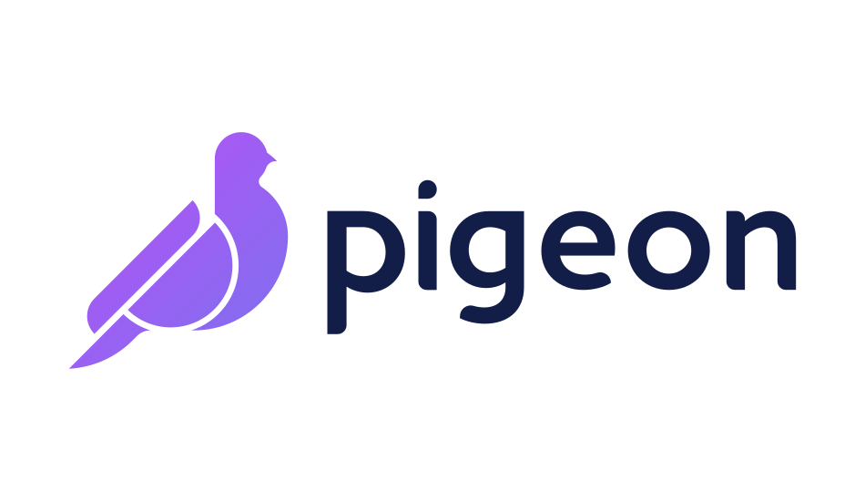

Pigeon is a Laravel package for dealing with AMQP messaging with easy syntax on top of php-amqplib. 

## Documentation
[Documentation](https://convenia.github.io/Pigeon)
sdfdsfsdfdsf
## Contributing
Pull requests are welcome. For major changes, please open an issue first to discuss what you would like to change.

Please make sure to update tests as appropriate.

## License
[MIT](https://choosealicense.com/licenses/mit/)
